# कृषि Mitra (Krushi Mitra)
## AI-Powered Smart Farmer Assistance Platform
**ज्ञान | मार्गदर्शन | समृद्धी** (Knowledge | Guidance | Prosperity)

Krushi Mitra is a complete full-stack agricultural decision-support platform designed to help farmers make data-driven decisions. It integrates soil health analysis, location-based services, weather forecasts, market dynamics, and historical data to deliver actionable, personalized crop and seed recommendations.

---

## 1. Product Vision & Core Flow
Krushi Mitra acts as a digital farm companion. By analyzing key inputs, the system generates custom advice to optimize yield and minimize risks.

$$\text{Soil Data} + \text{Location} + \text{Weather} + \text{Season} + \text{Water Availability} + \text{Market Signals} + \text{Farm History} \longrightarrow \textbf{Personalized Crop \& Seed Advice}$$

---

## 2. Technology Stack

### Frontend (React Component-Wise Structure)
- **Framework:** React.js (via Vite)
- **Language:** JavaScript / TypeScript
- **Styling:** Tailwind CSS / Vanilla CSS
- **State Management:** Redux Toolkit or Context API
- **API Client:** Axios
- **Localization:** React i18next (Marathi, Hindi, English UI)

### Backend
- **Core Framework:** Java 21 + Spring Boot 3.x (Spring MVC)
- **Security:** Spring Security + JWT (Refresh Token Rotation) + Role-Based Access Control (RBAC)
- **Persistence:** Spring Data JPA + Hibernate
- **Database:** PostgreSQL
- **Caching & Broker:** Redis
- **Storage:** AWS S3 (for private soil reports and images via Presigned URLs)
- **API Documentation:** OpenAPI 3 / Swagger UI

### Infrastructure & DevOps
- **Containerization:** Docker & Docker Compose
- **CI/CD:** GitHub Actions (lint, test, build, docker push)
- **Cloud Architecture:** AWS (Route 53, ALB, ECS Fargate/EC2, RDS PostgreSQL, S3, Secrets Manager, CloudWatch)

---

## 3. Directory Structure

This repository follows a clean, modular structure split by service/layer, optimal for independent scaling and containerized deployments:

```
krushi-mitra/
├── frontend/                     # React.js SPA (Vite)
│   ├── public/                   # Static assets
│   └── src/
│       ├── assets/               # Local images, logos, fonts
│       ├── components/           # Reusable UI components (Buttons, Cards, Inputs, etc.)
│       ├── pages/                # Page-level components (Home, Dashboard, SoilTest, etc.)
│       ├── services/             # API client & integration layers (axios, weatherApi, etc.)
│       ├── hooks/                # Custom React hooks (useAuth, useGeolocation)
│       ├── store/                # Global state (Redux slices or Context providers)
│       ├── i18n/                 # Translation JSON files (English, Marathi, Hindi)
│       ├── App.jsx               # Main React Router setup
│       ├── index.css             # Tailwind CSS & global styles
│       └── main.jsx              # Vite Entrypoint
│
├── backend/                      # Java Spring Boot Service (Maven)
│   ├── src/
│   │   ├── main/
│   │   │   ├── java/com/krushimitra/
│   │   │   │   ├── controller/   # REST Controllers (Auth, Farms, Recommendations, etc.)
│   │   │   │   ├── service/      # Business Logic interfaces & implementations
│   │   │   │   ├── repository/   # Spring Data JPA Repository interfaces
│   │   │   │   ├── entity/       # JPA Database Entities
│   │   │   │   ├── dto/          # Data Transfer Objects (Requests & Responses)
│   │   │   │   ├── mapper/       # Entity-DTO Mappers (MapStruct or Manual)
│   │   │   │   ├── security/     # JwtFilters, SecurityConfig, UserDetails
│   │   │   │   ├── config/       # Redis, S3, Swagger, Async configurations
│   │   │   │   ├── exception/    # Custom exceptions & global exception handler
│   │   │   │   ├── validation/   # Custom validators (e.g., file types, inputs)
│   │   │   │   ├── integration/  # Third-party API clients (Weather, Mandi, OCR)
│   │   │   │   ├── recommendation/# Recommendation scoring engine logic
│   │   │   │   ├── notification/ # Event/SMS/Push notifications
│   │   │   │   └── audit/        # Audit logging components
│   │   │   └── resources/
│   │   │       ├── db/migration/ # Flyway/Liquibase migration scripts
│   │   │       └── application.yml
│   │   └── test/                 # JUnit 5, Mockito, Testcontainers tests
│   └── pom.xml
│
├── ml-service/                   # Optional Python FastAPI service for Crop Disease Classification
├── infra/
│   ├── docker/                   # Dockerfiles for staging/production builds
│   └── aws/                      # CloudFormation / Terraform / CDK scripts
├── docs/
│   └── openapi/                  # Static swagger/openapi specification specs
├── .github/
│   └── workflows/                # CI/CD action files
├── docker-compose.yml            # Local development orchestration (Frontend, Backend, Postgres, Redis)
└── README.md                     # Project specification & developer guide
```

---

## 4. Database Schema Design (PostgreSQL)

The persistence layer consists of the following key tables:
- **`users`:** Core auth table containing credentials, status, role, and preferred language.
- **`farmers`:** Profiles linking users to personal farmer details.
- **`farms`:** Location (lat/long), land area, water sources, and soil types.
- **`soil_tests`:** Soil metrics (pH, N, P, K, moisture, organic carbon).
- **`soil_reports`:** S3 keys and OCR extraction status for uploaded PDF/image lab reports.
- **`sensor_devices` & `sensor_readings`:** IoT telemetry data.
- **`weather_records`:** Localized atmospheric history & forecasts.
- **`crops` & `crop_requirements`:** Knowledge base mapping crop thresholds.
- **`seed_varieties`:** Detailed regional seed availability.
- **`recommendations` & `recommendation_items`:** Results of the decision engine.
- **`market_prices`:** Historical and latest agricultural market (mandi) prices.
- **`crop_scans`:** advisory logs for crop leaf image classification.
- **`crop_tasks`:** Actionable schedules/reminders generated for the farmer.
- **`notifications`:** Delivery logs for SMS, push, or in-app alerts.
- **`audit_logs`:** Logging for sensitive actions.

---

## 5. REST API Architecture (`/api/v1`)

| Method | Endpoint | Group | Purpose |
|--------|----------|-------|---------|
| `POST` | `/api/v1/auth/register` | Auth | Register new credentials |
| `POST` | `/api/v1/auth/login` | Auth | Login to retrieve JWT access/refresh tokens |
| `POST` | `/api/v1/auth/refresh` | Auth | Obtain a new access token via refresh token |
| `POST` | `/api/v1/auth/logout` | Auth | Invalidate current JWT / logout session |
| `GET`  | `/api/v1/farmers/me` | Farmer | Retrieve current farmer profile |
| `PUT`  | `/api/v1/farmers/me` | Farmer | Update current farmer profile |
| `POST` | `/api/v1/farms` | Farm | Add a new farm with GPS coordinates |
| `GET`  | `/api/v1/farms` | Farm | List all registered farms for farmer |
| `GET`  | `/api/v1/farms/{id}` | Farm | View detailed information for a single farm |
| `PUT`  | `/api/v1/farms/{id}` | Farm | Update farm metadata/water source |
| `POST` | `/api/v1/farms/{id}/soil-tests` | Soil | Save manual/sensor soil test readings |
| `POST` | `/api/v1/soil-reports` | Soil | Upload physical soil report (PDF/Image) to S3 |
| `POST` | `/api/v1/soil-reports/{id}/ocr` | Soil | Execute OCR processing pipeline |
| `POST` | `/api/v1/recommendations` | Engine | Compute and return crop recommendation |
| `GET`  | `/api/v1/recommendations/{id}` | Engine | View specific recommendation results |
| `GET`  | `/api/v1/weather/current` | Weather | Get weather conditions using farm coordinates |
| `GET`  | `/api/v1/weather/forecast` | Weather | Retrieve multi-day forecast for farm |
| `GET`  | `/api/v1/market-prices` | Mandi | Query latest mandi prices by district/commodity |
| `GET`  | `/api/v1/market-prices/history` | Mandi | Query price trend records |
| `POST` | `/api/v1/crop-scans` | Advisory | Upload crop photo for disease/health scanning |
| `GET`  | `/api/v1/nearby-services` | Map | Get nearby soil labs, govt offices, and markets |
| `GET`  | `/api/v1/notifications` | Alerts | Retrieve active alerts and calendar events |
| `POST` | `/api/v1/sensor/readings` | IoT | Ingest realtime readings from IoT devices |
| `GET`  | `/api/v1/farms/{id}/history` | History | Retrieve historical records of soil and crops |
| `GET`  | `/api/v1/admin/dashboard` | Admin | Overall system stats and audit trails |

---

## 6. Recommendation Engine Criteria

The crop engine uses a weighted heuristic based on agronomic standards. The starting configuration is:

| Factor | Weight | Parameter Details |
|--------|--------|-------------------|
| **Soil Profile** | 30% | pH, Nitrogen (N), Phosphorus (P), Potassium (K), Moisture, Soil Type |
| **Weather & Climate** | 25% | Forecasted rain patterns, Temperature boundaries, Humidity levels |
| **Seasonality** | 10% | Verified season validity (Kharif, Rabi, Zaid) |
| **Water Source** | 10% | Dependability of Water (Borewell, Canal, Rain-fed, Well, etc.) |
| **Geographic Location** | 10% | Region-specific crop success index |
| **Farm History** | 10% | Previous crop rotations & soil trend direction |
| **Market Signals** | 5% | Real-time commodity demand trends & prices |

---

## 7. 20-Day Development Sprint Roadmap

```mermaid
gantt
    title Krushi Mitra 20-Day Implementation Timeline
    dateFormat DD
    axisFormat Day %d
    
    section Foundation
    Architecture & Environments (Day 1-2)    :active, d1, 01, 2d
    Auth & Farmer Profile Setup (Day 3-4)   :d3, 03, 2d
    section Core Infrastructure
    Database & Soil Upload Setup (Day 5-6)  :d5, 05, 2d
    OCR & Weather Integrations (Day 7-8)    :d7, 07, 2d
    section Decision Engine
    Crop Data & Recommendation (Day 9-11)    :d9, 09, 3d
    Market API & Analytics (Day 12-13)        :d12, 12, 2d
    Decision Tools & Farm Calendar (Day 14-15) :d14, 14, 2d
    section Quality & Release
    Advanced UX & Localization (Day 16)      :d16, 16, 1d
    Swagger API & Testing Suite (Day 17)      :d17, 17, 1d
    Docker, CI/CD, AWS Staging (Day 18-19)    :d18, 18, 2d
    Final Release & Demo Prep (Day 20)        :d20, 20, 1d
```



- **Day 1: Setup:** GitHub Repo, React/Vite, Spring Boot/Maven, Docker Compose skeleton.
- **Day 2: UI Foundation:** Core color scheme (60-25-10-5), theme, base layouts.
- **Day 3: Authentication:** Spring Security setup, register/login endpoints, React UI context.
- **Day 4: Farmer/Farm:** Profiles, Farm CRUD, GPS maps widget.
- **Day 5: Database:** Entities, relations, Flyway/Liquibase migration configurations.
- **Day 6: Soil Upload:** S3 file storage upload backend, file validation.
- **Day 7: OCR:** Tesseract/Cloud OCR API integration, extraction JSON parser.
- **Day 8: Weather:** Current/forecast APIs, coordinate integrations, caching.
- **Day 9: Crop/Seed Data:** Master crop profiles and seed varieties database seeding.
- **Day 10: Recommendation:** Weighted scoring engine backend implementation.
- **Day 11: Seed Recommendation:** Seed variety matchings and dashboard detail pages.
- **Day 12: Market API:** Mandi open API sync service scheduler.
- **Day 13: Market Intelligence:** Nearest market comparisons and historical graphs.
- **Day 14: Decision Tools:** What-if simulator calculator and profit estimators.
- **Day 15: Farm Calendar:** Action items generator scheduler, alerts notifications.
- **Day 16: Advanced UX:** Crop-health camera mock framework, Multi-language/Voice configurations.
- **Day 17: Swagger + Tests:** Test coverage (JUnit, Mockito), OpenAPI/Swagger UI endpoints.
- **Day 18: Docker + CI/CD:** Multi-stage production Dockerfiles, GitHub workflows.
- **Day 19: AWS + Monitoring:** Cloud deployment setup, actuator setup, Cloudwatch alerts.
- **Day 20: Final Release:** Sample demo seeding, validation checks, finalized documentation.
